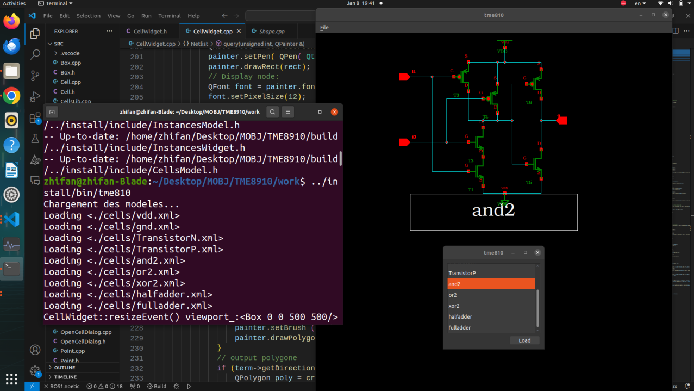

# Netlist Visualizer

Netlist Visualizer is a C++ application that implements a data structure to design a circuit and uses Qt for visualization. 

## Implementation

The application uses a custom `Cell` class to represent the components of the circuit. Each cell can be loaded with a predefined model such as "vdd", "gnd", "TransistorN", "TransistorP", "and2", "or2", "xor2", "halfadder", and "fulladder". 

The main function initializes a `QApplication` and a `CellViewer` (which inherits from `QMainWindow`). The `CellViewer` is set to display a specific cell and then shown on the screen. The Qt event loop is started with `qa->exec()`, and the application runs until the event loop ends.

```cpp
int main ( int argc, char* argv[] )
{
    cout << "Chargement des modeles..." << endl;
    Cell::load( "vdd" );
    Cell::load( "gnd" );
    Cell::load( "TransistorN" );
    Cell::load( "TransistorP" );
    Cell::load( "and2" );
    Cell::load( "or2" );
    Cell::load( "xor2" );
    Cell* halfadder = Cell::load( "halfadder" );
    Cell* fulladder = Cell::load( "fulladder" );

    QApplication* qa = new QApplication( argc, argv );
    CellViewer* viewer = new CellViewer();
    viewer->setCell( halfadder );
    viewer->show();
    int rvalue = qa->exec();
    delete qa;
    return rvalue;
}
```

## Example API
Here is an example of how to use the API to create a full adder circuit:
```cpp
// -> ENTITY
  Cell* fulladder = new Cell ( "fulladder" );
  // -> PORT 
  new Term( fulladder, "cin"  , Term::In  );
  new Term( fulladder, "a"    , Term::In  );
  new Term( fulladder, "b"    , Term::In  );
  new Term( fulladder, "sout" , Term::Out );
  new Term( fulladder, "cout" , Term::Out );
  // -> PORT MAP (Init)
  Net*      fa_cin      = new Net       ( fulladder, "cin"    , Term::External );
  Net*      fa_a        = new Net       ( fulladder, "a"      , Term::External );
  Net*      fa_b        = new Net       ( fulladder, "b"      , Term::External );
  Net*      fa_sout     = new Net       ( fulladder, "sout"   , Term::External );
  Net*      fa_cout     = new Net       ( fulladder, "cout"   , Term::External );
  // -> SIGNAUX
  Net*      fa_sout_1   = new Net       ( fulladder, "sout_1" , Term::Internal );
  Net*      fa_carry_1  = new Net       ( fulladder, "carry_1", Term::Internal );
  Net*      fa_carry_2  = new Net       ( fulladder, "carry_2", Term::Internal );
  // -> COMPONENT (Instanciation)
  Instance* fa_ha1      = new Instance  ( fulladder, Cell::find("halfadder"), "ha1" );
  Instance* fa_ha2      = new Instance  ( fulladder, Cell::find("halfadder"), "ha2" );
  Instance* fa_or2      = new Instance  ( fulladder, Cell::find("or2")      , "or2" );
  // -> PORT MAP  (Connexion)
  // External PORT MAP
  fulladder->connect( "cin" ,  fa_cin  ); // Connexion (Term, Net)
  fulladder->connect( "a"   ,  fa_a    );
  fulladder->connect( "b"   ,  fa_b    );
  fulladder->connect( "sout",  fa_sout );
  fulladder->connect( "cout",  fa_cout ); 
  // Internal SIGNAL PORT MAP
  fa_ha1->connect( "a"    , fa_a );
  fa_ha1->connect( "b"    , fa_b );
  fa_ha1->connect( "sout" , fa_sout_1 );
  fa_ha1->connect( "cout" , fa_carry_1 );
  fa_ha2->connect( "a"    , fa_cin );
  fa_ha2->connect( "b"    , fa_sout_1 );
  fa_ha2->connect( "sout" , fa_sout );
  fa_ha2->connect( "cout" , fa_carry_2 );
  fa_or2->connect( "i0"   , fa_carry_2 );
  fa_or2->connect( "i1"   , fa_carry_1 );
  fa_or2->connect( "q"    , fa_cout );
```
## Example Execution

